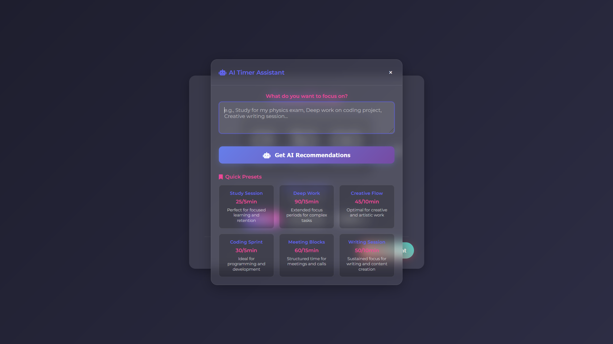

# PulseTimer 🤖

A modern work timer with AI-powered recommendations. Get smart timer settings based on your goals, plus beautiful design and focus features.

🌐 **[Try PulseTimer Online](https://timer.toxi360.org)**





## ✨ Features

- **🤖 AI Assistant** - Describe your goal, get smart timer recommendations
- **🎯 8 Presets** - Study, Deep Work, Creative, Coding, Meeting, Writing, Research, Exercise
- **⏱️ Flexible Timer** - Custom work/break intervals, session names, progress tracking
- **🔔 Smart Notifications** - Desktop alerts and audio feedback
- **🎨 Modern Design** - Clean interface, responsive for all devices
- **📊 Session History** - Track your daily productivity
- **🔒 Privacy Focused** - All data stays local, timer hide mode

## 🚀 Quick Start

### Online Usage
Visit [timer.toxi360.org](https://timer.toxi360.org) to use PulseTimer directly in your browser. No installation required!

### Local Installation

1. **Clone the repository:**
```bash
git clone https://github.com/Efeckc17/PulseTimer.git
cd PulseTimer
```

2. **Install dependencies:**
```bash
npm install
```

3. **Set up AI (optional):**
```bash
echo "OPENROUTER_API_KEY=your_key_here" > .env
```

4. **Start the server:**
```bash
npm start
```

5. **Open your browser and visit:**
```
http://localhost:5678
```

**AI Setup (Optional):** Get a free API key from [OpenRouter](https://openrouter.ai) for AI recommendations. Works fine without it too!

## 🛠️ Tech Stack

- **Frontend**: HTML5, CSS3, JavaScript (ES6 modules)
- **Backend**: Node.js, Express
- **AI**: OpenRouter API (GPT-3.5-turbo)
- **Audio**: Web Audio API
- **Notifications**: Web Notifications API
- **Security**: Helmet.js

## 🚀 Usage

1. **AI Assistant**: Click the floating button → describe your goal → get recommendations
2. **Manual Setup**: Set work duration, break intervals, session name
3. **Start Timer**: Play/pause/reset, track progress
4. **Smart Breaks**: Auto breaks with notes, skip if needed
5. **History**: Check your daily sessions in settings


## 🤝 Contributing

Found a bug? Want a feature? PRs welcome!

1. Fork the repo
2. Make your changes  
3. Submit a PR

## 💝 Support

- ⭐ Star the repo
- ☕ [Buy me a coffee](https://buymeacoffee.com/toxi360)
- 🐛 Report issues

## 📜 License

PulseTimer is licensed under the [Apache License 2.0](LICENSE).

---

**Made with ❤️ by [@Efeckc17](https://github.com/Efeckc17)**
