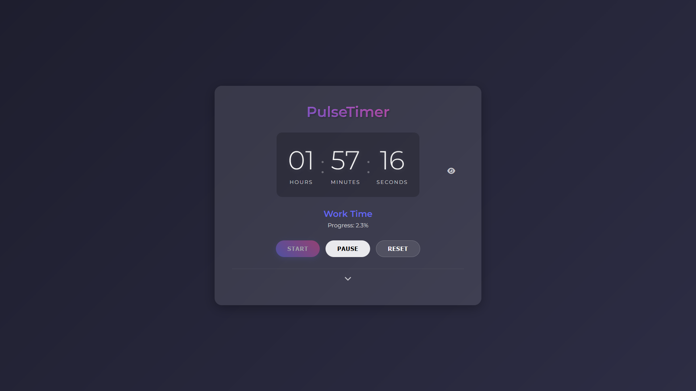
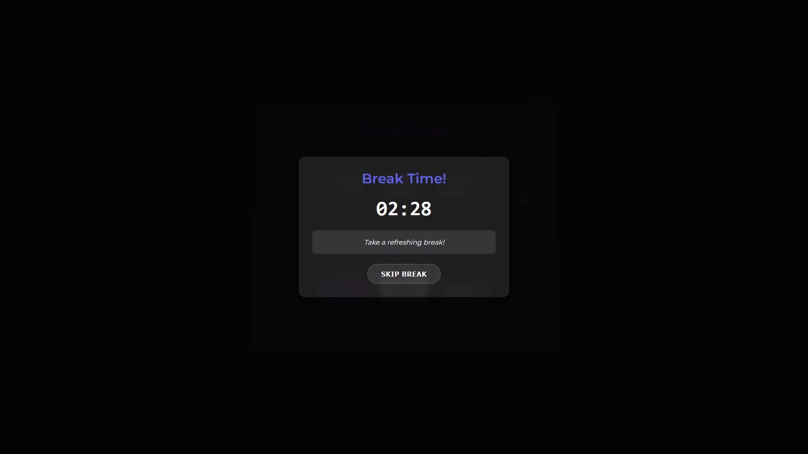
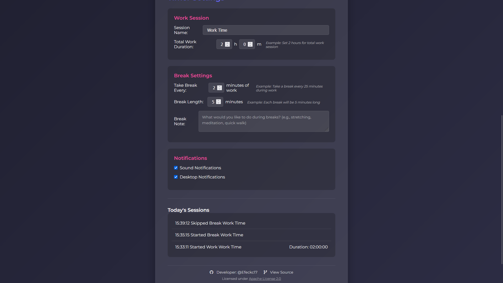

# PulseTimer

A modern, feature-rich work timer application designed to boost productivity through structured work and break sessions. PulseTimer helps you maintain a healthy work-life balance by managing your work intervals and breaks effectively.

🌐 **[Try PulseTimer Online](https://timer.toxi360.org)**





## ✨ Features

- **Customizable Work Sessions**
  - Set total work duration
  - Personalize session names
  - Track progress in real-time

- **Smart Break Management**
  - Configure break intervals
  - Customizable break durations
  - Break reminders with notes
  - Option to skip breaks when needed

- **User-Friendly Interface**
  - Clean, modern design
  - Collapsible settings panel
  - Timer display toggle (for privacy)
  - Responsive layout for all devices

- **Notification System**
  - Desktop notifications
  - Sound alerts
    - Work session start sound
    - Break time notification
    - Session completion alert
  - Customizable notification preferences
  - Browser permission management

- **Session Tracking**
  - Daily session history
  - Progress tracking
  - Session statistics

## 🚀 Quick Start

### Online Usage
Visit [timer.toxi360.org](https://timer.toxi360.org) to use PulseTimer directly in your browser. No installation required!

### Local Installation

1. Clone the repository:
```bash
git clone https://github.com/Efeckc17/PulseTimer.git
cd PulseTimer
```

2. Install dependencies:
```bash
npm install
```

3. Start the server:
```bash
npm start
```

4. Open your browser and visit:
```
http://localhost:5678
```

## 🛠️ Technical Stack

- **Frontend**: HTML5, CSS3, JavaScript (ES6+)
- **Backend**: Node.js, Express
- **Security**: Helmet.js
- **Notifications**: Web Notifications API, Web Audio API
- **Audio**: Custom sound effects for events
- **Icons**: Font Awesome

## 📋 Usage Guide

1. **Setting Up Work Session**
   - Set your total work duration
   - Customize session name
   - Configure break intervals

2. **Managing Breaks**
   - Set break duration (default: 5 minutes)
   - Add break notes for activities
   - Enable/disable notifications

3. **During Work**
   - Start/pause/reset timer as needed
   - Monitor progress
   - Receive break notifications with sound alerts
   - Audio feedback for session events
   - Toggle timer display for privacy

4. **Break Time**
   - Take breaks when notified
   - View break notes
   - Skip if necessary
   - Return to work automatically

## 🔒 Privacy & Security

- No data collection
- All settings stored locally
- Secure HTTP headers with Helmet.js
- No external tracking

## 🤝 Contributing

Contributions are welcome! Feel free to:
- Report bugs
- Suggest features
- Submit pull requests

## 📜 License

PulseTimer is licensed under the [Apache License 2.0](LICENSE).
